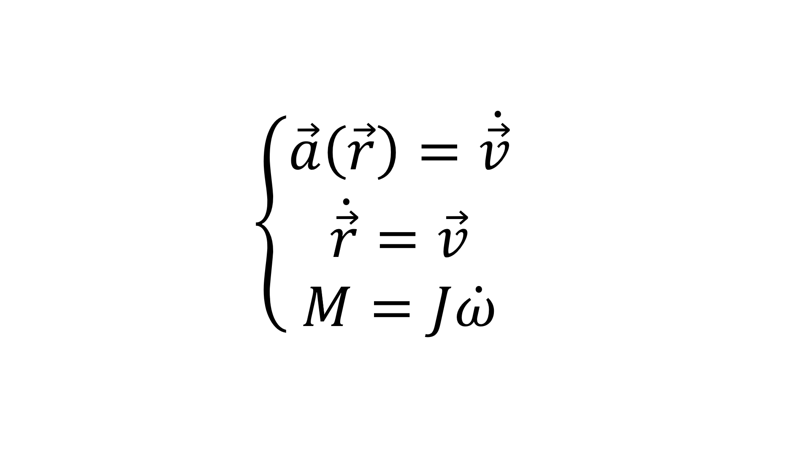
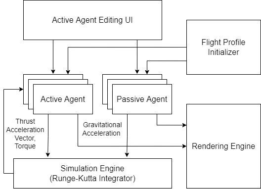

# 2D Rocket Simulation

## Category
- About the Project
- Block Diagram
- Live Demo
- Project Setup
- Expansion
- Customize configuration


## About the Project

### Functions of this Project
User can use this project to estimate the orbit of a rocket or a satllite and providing a comprehensive opertaion which can closely to reality to simulate the orbit of launch vehicle and remainings with a visualized pannel without the effect of aerodynamic, multibody question, light prssure, friction of atmosphere, irregular gravitation field resulting from uneven earth surface and so on. This project provides user with the flying orbit and allowing user to observe the angle of attack. And also, some rockets including CZ-5, one of the China's largest rocket, have been saved in the file `rocket-config.json` in file folder config already. Meanwhile, user can simulate the orbit of satllite no matter in LEO, MEO, GEO or SSO.

### Programming Language and Frame
This project uses JavaScript and the library vue as frame.


<br>


### Core Algorithm
The project mainly use four stage Runge-Kutta method to solve the differential equations by the following codes.




### structure of the project
This project mainly have two parts: several class designed for visualize and solving the differential equations and the basic structure of vue library. There is several classes including `Engine`, `ActiveAgent`, `PasiveAgent`, `rocekt` and so on. These classes allow the project to detect wheter the simulation progress is over and also allow users to change the initial condition of spacecraft and set more complex actions like designing a multistage rocket and have functions to seperate different stages which will keep simulate the orbit of remainings.

## Block Diagram


## Live Demo
[Live Demo](https://www.google.com)

## Project setup

### 1. Step 1 Install npm
```
npm install
```

### 2. Compiles and hot-reloads for development
```
npm run serve
```

### 3. Compiles and minifies for production
```
npm run build
```

## Expansion
### set condition fastly
Usesrs can set their sattlites' initial condition in the pannels on the right and look up for informations about orbit on the other sheet of the pannel.

### Add some users own contents
This project provide users some ways to expand project or save some of the designs they made. Users can add their own designs in ```rocket-config.json```, setting up a new object containing all information.  

### Lints and fixes files
Save the file and it may return some errors about typing problems. Users can just run the code below
```
npm run lint
```

## Customize configuration
See [Configuration Reference](https://cli.vuejs.org/config/).

